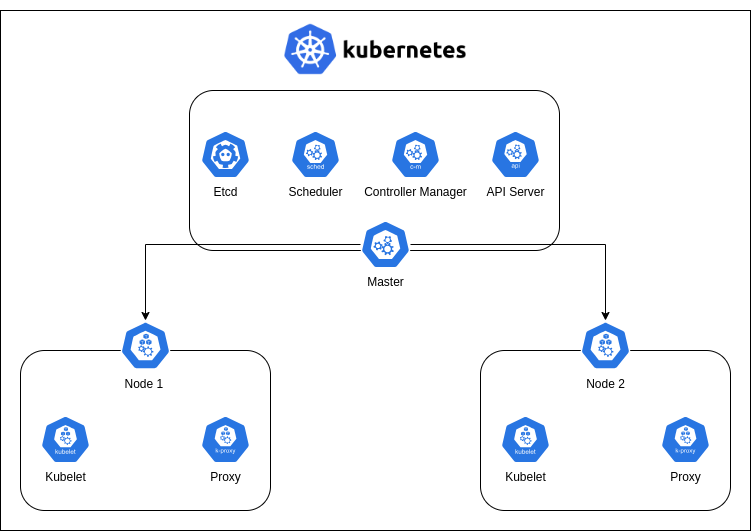

# Vagrantfile e scripts para automatizar a configuração do Kubernetes usando o Kubeadm
Cluster Kubernetes distribuído localmente com Vagrant, Ansible e VirtualBox, uso para demo.


## Pré-requisitos
- Sistema operacional Linux
- Host server com 8G+ memória (mais é melhor), 60G disk (mínimo), 4 core cpu (mais é melhor)
- Vagrant 2.3.4 
- VirtualBox 6.1.38

## Para provisionar o cluster, execute os seguintes comandos.
```sh
$ git clone https://github.com/AdennTumba/vagrant-kebernetes-cluster.git
$ cd vagrant-kebernetes-cluster
$ vagrant up
```
## Para acessar o cluster
```sh
$ vagrant ssh [nome do cluster]
ou
$ ssh vagrant@[ip do cluste de destino]

Password: vagrant
```
Agora devemos ter um cluster Kubernetes de 3 nós em execução em nossa máquina local:
```sh
$ vagrant ssh k8s-master
$ kubectl get node -o wide
NAME         STATUS   ROLES           AGE     VERSION   INTERNAL-IP   EXTERNAL-IP   OS-IMAGE             KERNEL-VERSION      CONTAINER-RUNTIME
k8s-master   Ready    control-plane   16m     v1.26.0   10.0.2.15     <none>        Ubuntu 20.04.6 LTS   5.4.0-144-generic   containerd://1.6.12
k8s-node-1   Ready    <none>          58s     v1.26.0   10.0.2.15     <none>        Ubuntu 20.04.6 LTS   5.4.0-144-generic   containerd://1.6.12
k8s-node-2   Ready    <none>          5m58s   v1.26.0   10.0.2.15     <none>        Ubuntu 20.04.6 LTS   5.4.0-144-generic   containerd://1.6.12
```
```sh
$ kubectl cluster-info
Kubernetes control plane is running at https://192.168.56.10:6443
CoreDNS is running at https://192.168.56.10:6443/api/v1/namespaces/kube-system/services/kube-dns:dns/proxy

To further debug and diagnose cluster problems, use 'kubectl cluster-info dump'.
```
```sh
$ kubectl get all --all-namespaces
NAMESPACE     NAME                                          READY   STATUS    RESTARTS   AGE
kube-system   pod/calico-kube-controllers-b48d575fb-pmzjx   1/1     Running   0          20m
kube-system   pod/calico-node-7lqvm                         1/1     Running   0          9m44s
kube-system   pod/calico-node-gtd8g                         1/1     Running   0          20m
kube-system   pod/calico-node-qlfkr                         1/1     Running   0          4m44s
kube-system   pod/coredns-787d4945fb-88ctm                  1/1     Running   0          20m
kube-system   pod/coredns-787d4945fb-mpwmv                  1/1     Running   0          20m
kube-system   pod/etcd-k8s-master                           1/1     Running   0          20m
kube-system   pod/kube-apiserver-k8s-master                 1/1     Running   0          20m
kube-system   pod/kube-controller-manager-k8s-master        1/1     Running   0          20m
kube-system   pod/kube-proxy-7f6q9                          1/1     Running   0          20m
kube-system   pod/kube-proxy-7qz2b                          1/1     Running   0          9m44s
kube-system   pod/kube-proxy-sxltb                          1/1     Running   0          4m44s
kube-system   pod/kube-scheduler-k8s-master                 1/1     Running   0          20m

NAMESPACE     NAME                 TYPE        CLUSTER-IP   EXTERNAL-IP   PORT(S)                  AGE
default       service/kubernetes   ClusterIP   10.96.0.1    <none>        443/TCP                  20m
kube-system   service/kube-dns     ClusterIP   10.96.0.10   <none>        53/UDP,53/TCP,9153/TCP   20m

NAMESPACE     NAME                         DESIRED   CURRENT   READY   UP-TO-DATE   AVAILABLE   NODE SELECTOR            AGE
kube-system   daemonset.apps/calico-node   3         3         3       3            3           kubernetes.io/os=linux   20m
kube-system   daemonset.apps/kube-proxy    3         3         3       3            3           kubernetes.io/os=linux   20m

NAMESPACE     NAME                                      READY   UP-TO-DATE   AVAILABLE   AGE
kube-system   deployment.apps/calico-kube-controllers   1/1     1            1           20m
kube-system   deployment.apps/coredns                   2/2     2            2           20m

NAMESPACE     NAME                                                DESIRED   CURRENT   READY   AGE
kube-system   replicaset.apps/calico-kube-controllers-b48d575fb   1         1         1       20m
kube-system   replicaset.apps/coredns-787d4945fb                  2         2         2       20m
```
## Para desligar o cluster
```sh
vagrant halt
```
## Para restartar o cluster
```sh
vagrant up
```
## Para destruir o cluster
```sh
vagrant destroy -f
```