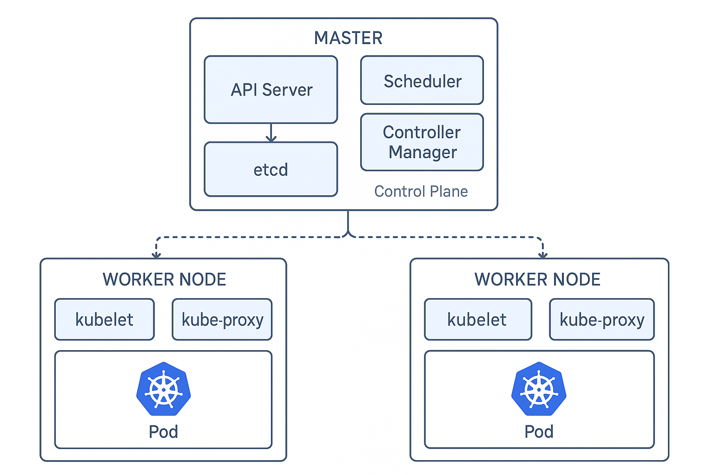

# Cluster Kubernetes Local com Vagrant, Ansible e VirtualBox

Este projeto permite a criação de um cluster Kubernetes local utilizando Vagrant, Ansible e VirtualBox. Ideal para testes, demonstrações e aprendizado, proporciona uma infraestrutura replicável e automatizada para simular ambientes de produção em ambientes locais.

## 🚀 Tecnologias Utilizadas

- [Vagrant](https://www.vagrantup.com/)
- [VirtualBox](https://www.virtualbox.org/)
- [Ansible](https://www.ansible.com/)
- [Kubernetes](https://kubernetes.io/)

## ✅ Pré-requisitos

- Sistema operacional Linux
- Mínimo recomendado:
  - 8 GB de RAM
  - 60 GB de espaço em disco
  - 4 CPUs
- [Vagrant 2.3.4+](https://www.vagrantup.com/downloads)
- [VirtualBox 6.1.38+](https://www.virtualbox.org/wiki/Downloads)

## ⚙️ Instalação

Clone o repositório e inicie o cluster com os seguintes comandos:

```bash
git clone https://github.com/adenntumba/vagrant-kubernetes-cluster.git
cd vagrant-kubernetes-cluster
vagrant up
```
## 🔧 Uso

Acesse o nó master:
```bash
vagrant ssh master
```
Verifique o status dos nós:
```bash
kubectl get nodes
```
Desligar o cluster
```bash
vagrant halt
```
Destruir o cluster
```bash
vagrant destroy -f
```
Startar o cluster
```bash
vagrant up
```

Todos os nós são automaticamente configurados com Kubernetes via Ansible.

## 🧱 Arquitetura do Cluster

- 1 nó master (master)

- 2 nós worker (worker-1, worker-2)

- Cada VM configurada com:

    - 2 CPUs

    - 2GB de RAM




## 🤝 Contribuição

Contribuições são bem-vindas! Se você encontrou um problema, deseja propor uma melhoria ou adicionar uma nova funcionalidade, fique à vontade para abrir uma issue ou enviar um pull request.

## 📄 Licença
Este projeto está licenciado sob a Licença MIT. Consulte o arquivo LICENSE para mais informações.